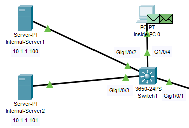
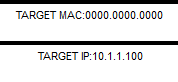

## ARP - Address Resolution Protocol

The **Address Resolution Protocol (ARP)** is a communication protocol used for discovering the **Data Link layer (Layer 2)** address, such as a MAC address, associated with a given internet layer address, typically an IPv4 address.

[Wikipedia - ARP](https://en.wikipedia.org/wiki/Address_Resolution_Protocol)

## Operating scope

The The **Address Resolution Protocol** is a request-response protocol whose messages encapsulated by a link layer protocol. It is communicated within the boundaries of a single network, never routed across internetworking nodes.

## Practical demonstration

We're sending an HTTP request from **Inside PC 0** to **Internal-Server2**.

Two packets are created: **ARP** and **TCP**

## Inside PC 0

### Outbound

#### Layer 2

1. The **ARP** process constructs a request for the target (_Internal Server1_) IP address (10.1.1.100).

2. The device encapsulates the PDU into an Ethernet frame.

#### Layer 1

1. FastEthernet0 sends out the frame (to _Switch1_).

## Switch1

### Inbound

#### Layer 1

1. GigabitEthernet1/0/4 receives the frame.

#### Layer 2

1. The frame source MAC address (0060.3EE7.1119) does not exist in the MAC table of Multilayer Switch. **Switch1** adds a new MAC entry to its table.

2. The frame destination MAC address is broadcast (FFFF.FFFF.FFFF). The Multilayer Switch processes the frame.

3. The frame's destination MAC address (FFFF.FFFF.FFFF) matches the receiving port's MAC address, the broadcast address, or a multicast address.

4. The device decapsulates the PDU from the Ethernet frame.

5. The frame is an **ARP frame**. The **ARP process** processes it.

6. The active VLAN interface is not up. The **ARP process** ignores the frame.

### Outbound

#### Layer 2

1. This is a broadcast frame. The Multilayer Switch sends out the frame to all ports in the same VLAN except the receiving port.

#### Layer 1

1. GigabitEthernet1/0/1 sends out the frame.

2. GigabitEthernet1/0/1 sends out the frame.

3. GigabitEthernet1/0/1 sends out the frame.

## Internal Server1

### Inbound

#### Layer 1

1. FastEthernet0 receives the frame.

#### Layer 2

1. The frame's destination MAC address (FFFF.FFFF.FFFF) matches the receiving port's MAC address, the broadcast address, or a multicast address.

2. The device decapsulates the PDU from the Ethernet frame.

3. The frame is an **ARP frame**. the **ARP process** processes it.

4. The **ARP frame** is a **request**.

5. the **ARP request**'s target IP address (10.1.1.100) matches the receiving port's IP address.

6. The **ARP process** updates the **ARP table** with received information.

### Outbound

#### Layer 2

1. The **ARP process** replies to the request with the receiving port's MAC address (0090.216B.0086).

2. The device encapsulates the PDU into and Ethernet frame.

#### Layer 1

1. FastEthernet0 sends out the frame.

## Switch1

### Inbound

#### Layer 1

1. GigabitEthernet1/0/4 receives the frame.

#### Layer 2

1. The frame source MAC address (0090.216B.0086) does not exist in the MAC table of MultiLayer Switch. **Switch1** adds a new MAC entry to its table.

2. This is a unicast frame. Multilayer Switch looks in its MAC table for the destination MAC address (0060.3EE7.1119).

### Outbound

#### Layer 2

1. The outgoing port is an access port. **Switch1** sends the frame out that port.

#### Layer 1

1. GigabitEthernet1/0/4 sends out the frame.

## Inside PC 0

### Inbound

#### Layer 1

1. FastEthernet0 receives the frame.

#### Layer 2

1. The frame's destination MAC address (0060.3EE7.1119) matches the receiving port's MAC address, the broadcast address, or a multicast address.

2. The device decapsulates the PDU from the Ethernet frame.

3. The frame is an **ARP frame**. the **ARP process** processes it.

4. The **ARP frame** is a **reply**.

5. the **ARP process** updates the **ARP** table with received information.

6. The **ARP process** takes out and sends buffer packets waiting for this **ARP reply**.
